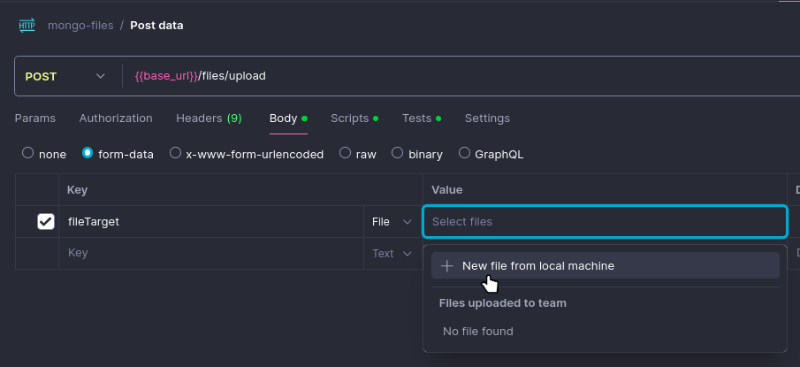

# Mongoose + Nodejs for files

Progress
- [x] Upload to mongo
- [x] download from mongo
- [x] get all files metadatas

Basic setup
```sh
$ cd mongo-files
$ npm install
$ node app.js
```

Then try to upload the files with Postman
* try upload invalid file (music, ...) too


Good Sources
* https://github.com/expressjs/multer
* https://github.com/miketvo/rmit-isys2099-group9-app/blob/main/server/routes/productRoutes.js
* https://dev.to/cyberwolves/how-to-upload-and-store-images-in-mongodb-database-c3f
* https://dev.to/collegewap/how-to-save-images-to-mongodb-in-nodejs-dog


